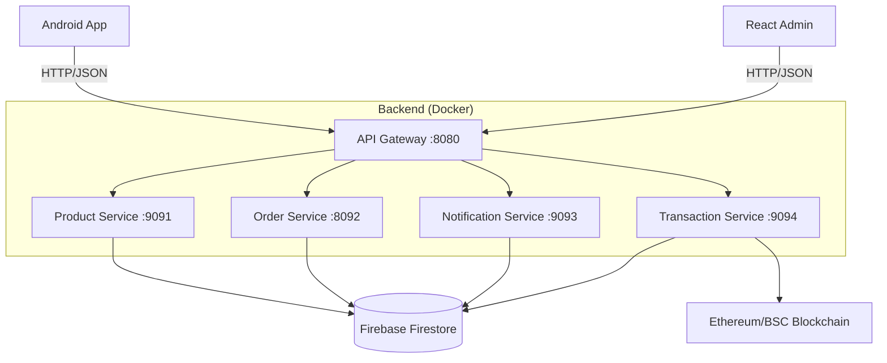

# 🛍️ Clot E-Commerce Ecosystem

A professional, full-stack e-commerce solution featuring a **Kotlin Android App**, a **Node.js Microservices Backend**, and a **React Admin Dashboard**.

---

## �️ Prerequisites & Setup

### 🔐 1. Firebase Service Account (Required for Backend)
1. Go to the [Firebase Console](https://console.firebase.google.com/) -> Project Settings -> Service Accounts.
2. Click **Generate new private key** and download the JSON file.
3. Rename the file to `firebase-service-account.json`.
4. **Place the file** in the `services/` root directory.

> [!IMPORTANT]
> **Security Note**: This file is shared across all microservices using Docker volumes. It is excluded from Git via `.gitignore`. You must manually place it in the `services/` directory for the backend to function correctly.

### 2. Android Google Services
1. Place your `google-services.json` in the `app/` directory.

### 🔐 3. Web Admin Dashboard Configuration
1. Go to the `web-admin/` directory.
2. Copy `.env.example` to `.env`.
3. Fill in your Firebase Web SDK configuration (API Key, Project ID, etc.).
4. Set `VITE_API_URL=http://localhost:8080` (or your backend URL).

---

## 🚀 Quick Start (Get Running in 5 Mins)

### 1. Backend (The Brain)
```bash
cd services
# Ensure firebase-service-account.json is in this folder!
docker compose up --build -d
```
*Backend is now live at `http://localhost:8080`*

### 2. Admin Dashboard (The Control Room)
```bash
cd web-admin
npm install
npm run dev
```
*Dashboard is now live at `http://localhost:5173`*

### 3. Android App (The Storefront)
1. Open the `app/` folder in **Android Studio**.
2. Press **Run** (Shift + F10).

---

## 🏗️ System Architecture

Our system is built for scale using a modern microservices approach:



---

## 📱 Android App Setup
- **Language**: Kotlin
- **UI**: Jetpack Compose
- **Key Config**: `app/google-services.json`
- **API Connection**: Edit `ApiClient.kt` -> `BASE_URL`.
  - Use `http://10.0.2.2:8080` for Emulator.
  - Use your Computer IP for physical devices.

---

## ⚙️ Backend Services
We use **Docker** to make setup effortless. Each service handles a specific part of the business:

| Service | Port | Responsibility |
| :--- | :--- | :--- |
| **API Gateway** | `8080` | Security, Routing, Token Verification |
| **Product Service** | `9091` | Catalog, Inventory, Categories |
| **Order Service** | `8092` | Checkout, Order History, Admin Stats |
| **Notification Service**| `9093` | Push Notifications, Alerts |
| **Transaction Service** | `9094` | Blockchain Verification, Replay Protection |

---

## 💻 Admin Dashboard
A high-performance dashboard built with **React + Vite + Lucide Icons**.

- **Features**:
  - 📊 **Real-time Stats**: Revenue, Orders, and Active Users.
  - 📦 **Product Management**: Add, Edit, and Delete products with ease.
  - 👥 **Admin Management**: Control who has access to the dashboard.
  - 🌙 **Dark Mode**: Premium glassmorphism design.

---

## 🔗 Blockchain Integration (Web3)
 Clot supports **CToken (CLOT)** payments on the BSC Testnet.
- **Network**: BSC Testnet (Chain ID 97)
- **Wallet**: MetaMask Integration
- **Security**: Server-side verification of every transaction hash to prevent double-spending.

---

## 🌟 New Features (Dec 2025)

### 🎠 Banner Carousel
- **Multiple Active Banners**: The app now supports rotating through multiple active banners.
- **Auto-Scroll**: Banners automatically slide every 3 seconds.
- **Admin Control**: Set multiple banners as "Active" in the dashboard to enable the carousel.

### 🧠 Smart IP Replacement
- **Team-Ready**: The Android app automatically detects your connection environment.
- **Dynamic Images**: It replaces the hardcoded database IP (e.g., `192.168.x.x`) with your current server IP.
- **Benefit**: Share the database with your team without breaking image links!

---

## 🤝 Team Setup Guide (For Teammates)

If you are cloning this repo to run on your own machine:

1.  **Clone the Repo**: `git clone <repo-url>`
2.  **Setup Secrets**:
    - Ask the project lead for `firebase-service-account.json` -> put in `services/`.
    - Ask for `google-services.json` -> put in `app/`.
    - Ask for `.env` content -> put in `services/.env` and `web-admin/.env`.
3.  **Run Backend**:
    ```bash
    cd services
    docker compose up -d
    ```
4.  **Run Android App**:
    - Open `app/` in Android Studio.
    - **Important**: Open `ApiClient.kt` and check `BASE_URL`.
        - **Emulator**: Leave as `http://10.0.2.2:8080` (Works automatically).
        - **Physical Phone**: Change to your laptop's IP (e.g., `http://192.168.1.50:8080`).

---

## 🔍 Troubleshooting

**Q: Dashboard shows $0.00?**
- Check if `services-order-service` is running.
- Ensure your Firebase `orders` collection isn't empty.

**Q: Android App can't connect?**
- Make sure you aren't using `localhost`. Use `10.0.2.2` for the emulator.
- Check if the API Gateway container is up (`docker ps`).

**Q: Images are broken?**
- The "Smart IP" feature usually fixes this.
- If using a physical phone, ensure your phone and laptop are on the **same Wi-Fi**.
- Check if `BASE_URL` in `ApiClient.kt` matches your laptop's IP.

**Q: "Port already allocated" error?**
- Run `docker compose down` to clear old containers, then try again.

---

<div align="center">

### 🎓 Project Credits

| | |
| :--- | :--- |
| **Project** | **E-Commerce** |
| **Group** | **Group 2** |
| **Academic Year** | **Year 4, Semester 1** |
| **Professor** | **Heng Sovannarith** |
| **Institution** | **Royal University of Phnom Penh** |

</div>
